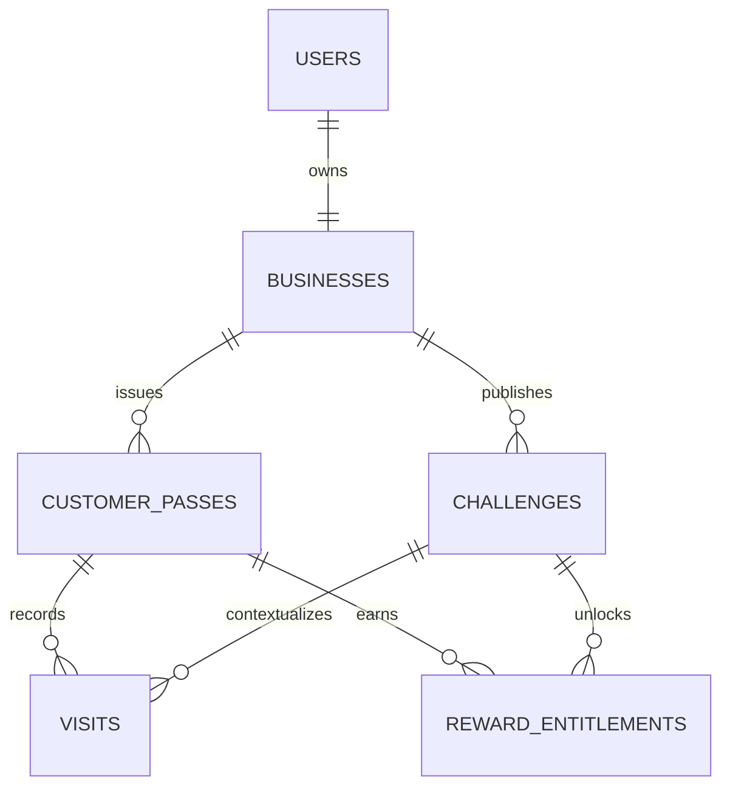
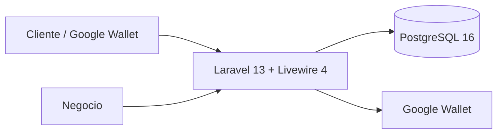

# FidelitoPass

> **Retos que hacen volver a tus clientes.**

**FidelitoPass** es una aplicación web de fidelización para pequeños negocios que transforma las visitas recurrentes en retos temporales simples, claros y divertidos.

El negocio crea un reto, define una recompensa y comparte un QR permanente. El cliente añade una única tarjeta a Google Wallet y la conserva para los retos futuros de ese negocio. Cada visita validada otorga puntos y actualiza el progreso del reto activo hasta desbloquear una recompensa que puede canjearse antes de que termine el plazo.

La propuesta es deliberadamente pequeña: **visitas, puntos, reto y recompensa**. Sin CRM, sin analítica avanzada y sin aplicaciones móviles adicionales.

## Cómo funciona

```text
Negocio crea un reto
        ↓
Define una recompensa
        ↓
Cliente escanea el QR permanente
        ↓
Añade la tarjeta a Google Wallet
        ↓
Presenta la tarjeta en cada visita
        ↓
Negocio valida la visita
        ↓
FidelitoPass otorga los puntos que correspondan
        ↓
FidelitoPass actualiza el progreso
        ↓
Cliente completa el reto
        ↓
Recompensa disponible
        ↓
Negocio confirma el canje
        ↓
La misma tarjeta espera el próximo reto
```

## El diferencial

FidelitoPass utiliza una única mecánica fácil de explicar:

> **Visita → gana puntos → completa el reto → desbloquea una recompensa.**

Cada negocio mantiene un solo reto activo. El reto siempre consiste en alcanzar una meta de puntos antes de una fecha.

Ejemplo:

```text
🎯 RETO ACTUAL

Consigue 15 puntos antes del 30 SEP.

9 / 15 puntos

Tu visita ahora vale 1 punto.

🎁 Hamburguesa gratis
```

El negocio puede configurar cuánto vale una visita regular y, opcionalmente, una única regla especial para un día de la semana completo o una franja horaria de ese día.

Cuando esa regla está activa, la tarjeta lo comunica de forma inmediata:

```text
⚡ Ahora tu visita vale 2 puntos.
```

No existen tipos de reto combinables, rachas, reglas arbitrarias ni varios retos activos simultáneamente en el MVP.

## Una tarjeta permanente por negocio

El cliente conserva una única tarjeta Google Wallet para ese negocio.

```text
Cliente + Negocio
       ↓
Customer Pass permanente
       ↓
Google Wallet
       ↓
Reto actual cambia con el tiempo
```

Cuando un reto termina:

- Deja de aceptar progreso.
- Deja de aceptar canjes.
- La tarjeta permanece instalada.
- Muestra que el reto terminó o que pronto habrá uno nuevo.
- El siguiente reto reutiliza la misma tarjeta.

## Experiencia del cliente

La tarjeta siempre responde las mismas preguntas:

1. **¿Dónde estoy participando?**.
2. **¿Cuál es el reto?**.
3. **¿Cómo funciona?**.
4. **¿Cómo voy?**.
5. **¿Qué debo hacer ahora?**.
6. **¿Qué gano?**.
7. **¿Hasta cuándo?**.

Ejemplo:

```text
CAFÉ CENTRAL

🎯 RETO ACTUAL

Consigue 15 puntos antes del 30 SEP.

9 / 15 puntos

⚡ Ahora tu visita vale 2 puntos.

🎁 Café especial gratis
Válido hasta 30 SEP

[ código de validación ]
```

El progreso se representa con números y texto. No se generan círculos, sellos ni gráficos dinámicos para representar el progreso.

## Experiencia del negocio

La aplicación prioriza operaciones rápidas y simples.

### Dashboard

Muestra únicamente:

- Reto actual.
- Tarjetas emitidas.
- Puntos obtenidos en el reto actual.
- Recompensas desbloqueadas.
- Recompensas canjeadas.
- Accesos rápidos a **Validar visita**, **Gestionar reto** y **Mostrar QR**.

### Validar una visita

La página está pensada para atención rápida en mostrador:

```text
┌───────────────────────────┐
│      Cámara / scanner     │
└───────────────────────────┘

Código de la tarjeta
[ 482731                  ]
[ Buscar tarjeta ]

┌───────────────────────────┐
│ Estado y progreso         │
│                           │
│ [ Registrar visita ]      │
└───────────────────────────┘
```

El código manual está **siempre justo debajo del escáner**. No se oculta en modales, menús ni pantallas secundarias.

Si la cámara no está disponible, el mismo formulario manual permanece listo para utilizarse.

Cuando existe una recompensa disponible, la acción principal cambia a:

> **Canjear recompensa**

## Landing pública

La página principal explica FidelitoPass antes de mostrar cualquier panel de gestión.

Estructura:

1. Hero con la propuesta de valor.
2. Cómo funciona.
3. Cómo funcionan los puntos y el reto actual.
4. Una sola tarjeta Google Wallet.
5. CTA para crear el primer reto.

Copy principal sugerido:

> **Haz que volver sea parte del juego.**

> Crea retos de puntos, añade la tarjeta a Google Wallet y recompensa a tus clientes cuando los completan.

## Diseño visual

FidelitoPass utiliza una interfaz limpia, ligera y redondeada.

### Light mode — por defecto

- Fondo marfil cálido.
- Superficies crema.
- Texto carbón.
- Bordes suaves.
- Verde lima como único color principal.

### Dark mode — opcional

- Fondo carbón verdoso.
- Superficies ligeramente más claras.
- Texto blanco cálido.
- El mismo verde lima como acento.

No se utilizan blanco puro ni negro puro como fondos principales.

Color principal:

```text
#B7F34A
```

Los estados de éxito, advertencia y error utilizan color + icono + texto. El color por sí solo nunca transmite el significado.

## Reglas de tiempo

Toda fecha/hora que representa un hecho del dominio se almacena como un instante UTC mediante PostgreSQL `timestamptz`.

El negocio configura una zona horaria IANA, por ejemplo:

```text
America/La_Paz
Europe/Madrid
```

Al publicar un reto, esa zona horaria se guarda como parte del reto para que sus reglas históricas nunca cambien.

Las visitas guardan únicamente:

```text
visited_at
```

No se persiste una fecha local duplicada.

Cuando FidelitoPass necesita saber el día local de una visita, PostgreSQL lo calcula utilizando la zona horaria del reto.

Ejemplo:

```text
2026-09-22 02:30 UTC -> 2026-09-21 22:30 America/La_Paz
2026-09-22 05:00 UTC -> 2026-09-22 01:00 America/La_Paz
```

Aunque ambos instantes pertenecen al 22 de septiembre en UTC, pertenecen a días locales diferentes.

Las decisiones de vigencia utilizan el reloj de PostgreSQL, no el reloj del navegador ni del servidor PHP.

## Modelo conceptual



El canje final se representa en el propio `RewardEntitlement` mediante `redeemed_at` y `redeemed_by_user_id`. Para el MVP no es necesaria una tabla adicional de redenciones.

## Arquitectura general

FidelitoPass es un **monolito Laravel convencional**.



PostgreSQL es la fuente de verdad.

Google Wallet:

- Muestra el reto.
- Muestra el progreso.
- Transporta el código de validación.
- Se actualiza después de cambios confirmados en PostgreSQL.

Una caída temporal de Google Wallet no revierte una visita o canje ya confirmado.

## Stack tecnológico

| Área | Tecnología |
|---|---|
| Backend | PHP 8.4, Laravel 13 |
| UI | Blade, Livewire 4, Alpine.js, Flux UI Free |
| CSS | Tailwind CSS 4 |
| Base de datos | PostgreSQL 16 |
| Autenticación | Laravel Starter Kit / Fortify |
| Tests PHP | Pest / PHPUnit |
| Browser testing | Playwright |
| Análisis estático | Larastan / PHPStan |
| Formato | Laravel Pint |
| Desarrollo local | Docker + Laravel Sail |
| Build frontend | Vite |
| Integración externa | Google Wallet |
| Logging | Laravel + Monolog, JSON en producción |

## Instalación local

### Requisitos

- Git.
- Docker con Docker Compose.

El flujo normal no requiere instalar PHP, PostgreSQL o Node directamente en el host.

### 1. Clonar el repositorio

```bash
git clone <repository-url> fidelitopass
cd fidelitopass
```

### 2. Crear configuración local

```bash
cp .env.dev.example .env
```

### 3. Instalar dependencias PHP para disponer de Sail

Linux/macOS/WSL:

```bash
docker run --rm \
  -u "$(id -u):$(id -g)" \
  -v "$PWD:/app" \
  -w /app \
  composer:2 composer install
```

### 4. Iniciar servicios

```bash
./vendor/bin/sail up -d
```

### 5. Ejecutar setup

```bash
./vendor/bin/sail composer setup
```

La aplicación estará disponible normalmente en:

```text
http://localhost:8000
```

## Comandos de calidad

```bash
# Suite PHP
./vendor/bin/sail composer test

# Formato PHP
./vendor/bin/sail composer check:format

# Análisis estático
./vendor/bin/sail composer check:lint

# Tooling/frontend tests
./vendor/bin/sail npm test

# Build de producción
./vendor/bin/sail npm run build
```

Los scripts del repositorio mantienen los quality gates y controles de seguridad configurados para el proyecto.

## Seguridad

FidelitoPass aplica un conjunto pequeño de controles directamente relacionados con el producto:

- Autorización por propiedad del negocio.
- CSRF y sesiones Laravel.
- Validación autoritativa en servidor.
- Eloquent/query binding para consultas.
- Separación entre QR público y token privado de validación.
- Rate limiting en autenticación y lookup/validación.
- Transacciones y bloqueos para visitas/canjes.
- Secretos fuera del código fuente.
- Debug desactivado en producción.
- Logging estructurado sin credenciales.
- Escaneo de dependencias y secretos en el flujo de calidad.

## Logging

En producción, los logs se escriben como JSON estructurado para facilitar una futura integración con sistemas de agregación.

Ejemplo conceptual:

```json
{
  "event": "visit.accepted",
  "request_id": "019...",
  "business_id": 12,
  "challenge_id": 44,
  "customer_pass_id": 381,
  "outcome": "accepted"
}
```

Nunca se registran contraseñas, cookies, cabeceras de autorización, tokens privados de validación ni claves de Google Wallet.

## Estructura

```text
app/                    Código Laravel
bootstrap/              Bootstrap del framework
config/                 Configuración
database/               Migraciones, factories y seeders
docker/                 Runtime de producción
docs/                   Documentación técnica en inglés
public/                 Entrada HTTP y assets públicos
resources/              Blade/Livewire, CSS y JavaScript
routes/                 Rutas
scripts/quality/        Automatización de calidad y seguridad
skills/                 Convenciones operativas del proyecto
tests/                  Tests PHP y browser
Dockerfile              Imagen de producción
compose.yaml            Entorno local
```

## Documentación técnica

La documentación técnica se encuentra en [`docs/`](docs/README.md).

El orden de diseño es:

1. Concepto.
2. Alcance.
3. Catálogo de retos.
4. Requisitos.
5. Presentación Wallet.
6. UX.
7. Arquitectura y seguridad.
8. Estándares de datos/Laravel.
9. Calidad.
10. Plan de entrega.

Los documentos están separados por dominio de conocimiento y se consultan mediante lazy loading: una tarea abre únicamente la fuente que necesita.

## Fuera de alcance

FidelitoPass no incluye en el MVP:

- CRM.
- Analítica avanzada.
- Campañas email/SMS.
- Referidos.
- POS.
- Pagos.
- Múltiples sucursales.
- Roles de empleados.
- Múltiples retos simultáneos.
- Recompensas múltiples.
- Reglas personalizadas.
- Multiplicadores configurables.
- Apple Wallet.
- Aplicación móvil nativa.
- Marketplace de negocios.

## Licencia

Consulta [`LICENSE`](LICENSE).
