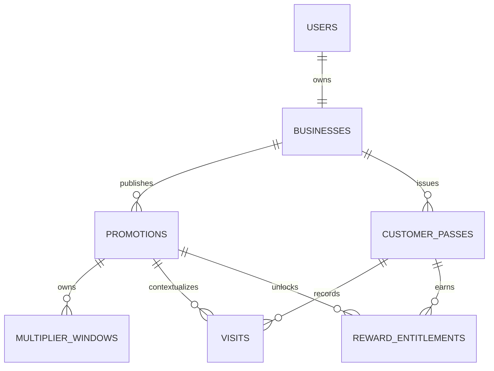
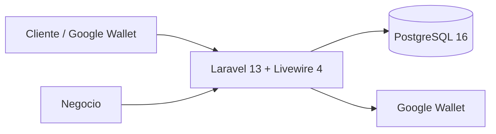

# FidelitoPass

> **Promociones que hacen volver a tus clientes.**

**FidelitoPass** es una aplicación web de fidelización para pequeños negocios que transforma las visitas recurrentes en Promociones temporales simples, claras y atractivas.

El negocio crea una Promoción, define una recompensa y comparte un QR público permanente. El cliente añade un único Pase a Google Wallet y lo conserva para las próximas Promociones de ese negocio. Cada visita confirmada otorga puntos y actualiza el progreso de la Promoción activa hasta desbloquear una recompensa canjeable dentro del plazo.

La propuesta es deliberadamente pequeña: **visitas, puntos, Promoción y recompensa**. Sin CRM, sin analítica avanzada y sin aplicaciones móviles adicionales.

> **Estado del proyecto:** este README presenta el diseño completo acordado del producto, no afirma que el MVP esté implementado. El repositorio cuenta con la base Laravel, autenticación, configuración del negocio y una landing con Pase y QR ilustrativos. La publicación de Promociones, la emisión real en Wallet, la validación de visitas y el canje son flujos previstos, no operaciones ya entregadas. Los ejemplos y diagramas no son evidencia de migraciones ni pruebas de extremo a extremo ejecutadas.

## Cómo funciona

Flujo de producto previsto:

```text
Negocio crea una Promoción
        ↓
Define una recompensa
        ↓
Cliente escanea el QR público permanente
        ↓
Añade el Pase a Google Wallet
        ↓
Presenta el Pase en cada visita
        ↓
Negocio confirma la visita
        ↓
FidelitoPass otorga los puntos que correspondan
        ↓
FidelitoPass actualiza el progreso
        ↓
Cliente completa la Promoción
        ↓
Recompensa disponible
        ↓
Negocio confirma el canje
        ↓
El mismo Pase espera la próxima Promoción
```

## El diferencial

FidelitoPass utiliza una única mecánica fácil de explicar:

> **Visita → gana puntos → completa la Promoción → desbloquea una recompensa.**

Cada negocio puede conservar varios borradores y Promociones futuras programadas, pero solo una Promoción puede estar efectivamente activa en un instante. La meta consiste en alcanzar un número de puntos antes de una fecha.

Ejemplo conceptual:

```text
🎯 PROMOCIÓN ACTUAL

Consigue 15 puntos antes del 30 SEP.

9 / 15 puntos

Tu visita ahora vale 1 punto.

🎁 Hamburguesa gratis
```

Cada visita regular confirmada vale **exactamente 1 punto**. Cada Promoción puede definir cualquier número de ventanas semanales propias de **Puntos extra** x2, x3 o x5, por día local completo o por franjas horarias de ese día. Las franjas son semiabiertas `[inicio, fin)`: pueden tocarse, pero no solaparse. Una regla de día completo no convive con franjas del mismo día; una franja que cruza medianoche se divide entre los días correspondientes. Se aplica un solo multiplicador por instante, nunca una suma de reglas; fuera de las ventanas rige x1. Ni el negocio ni la Promoción anterior transmiten reglas a una nueva Promoción. Los puntos ya otorgados permanecen inmutables.

Cuando una ventana está activa, el Pase lo comunica de forma inmediata como información de diseño; la actualización real desde el proveedor puede demorarse:

```text
⚡ Ahora tu visita vale 2 puntos.
```

No existen mecánicas combinables, rachas, reglas arbitrarias ni varias Promociones efectivamente activas simultáneamente en el MVP.

## Un Pase permanente por negocio

El cliente conserva un único Pase Google Wallet para ese negocio.

```text
Cliente + Negocio
       ↓
Pase de cliente permanente
       ↓
Google Wallet
       ↓
La Promoción actual cambia con el tiempo
```

Cuando una Promoción termina o se cancela:

- Deja de aceptar progreso y canjes para esa Promoción.
- El Pase permanece instalado.
- Muestra el estado final o la espera de una nueva Promoción.
- La siguiente Promoción reutiliza el mismo Pase sin borrar el historial.

Los estados previstos incluyen espera, progreso, recompensa disponible, recompensa canjeada, Promoción finalizada, recompensa vencida y Promoción cancelada. Completar la meta genera como máximo una recompensa por Pase y Promoción; el canje es final, una sola vez, antes del fin exclusivo y nunca después de una cancelación. No se reinicia el progreso para obtener otra recompensa en la misma Promoción.

## Experiencia del cliente

Durante una Promoción activa, el Pase responde las mismas preguntas:

1. **¿Dónde estoy participando?**
2. **¿Cuál es la Promoción?**
3. **¿Cómo funciona?**
4. **¿Cómo voy?**
5. **¿Qué debo hacer ahora?**
6. **¿Qué gano?**
7. **¿Hasta cuándo?**

Ejemplo conceptual:

```text
CAFÉ CENTRAL

🎯 PROMOCIÓN ACTUAL

Consigue 15 puntos antes del 30 SEP.

9 / 15 puntos

⚡ Ahora tu visita vale 2 puntos.

🎁 Café especial gratis
Válido hasta 30 SEP

[ código privado de validación ]
Código del Pase: 482731
```

El progreso se representa con números y texto. No se generan círculos, sellos ni gráficos dinámicos para representar el progreso. El código manual identifica el Pase para su búsqueda por el negocio; no sustituye la autorización del servidor ni es el secreto privado del código de barras. El QR público de invitación es otro identificador distinto y nunca autoriza una visita.

## Experiencia del negocio

La aplicación prevista prioriza operaciones rápidas y simples.

### Resumen y Pase

**Resumen** es el inicio habitual de la aplicación autenticada, no una parada obligatoria tras iniciar sesión. Si falta configuración, una acción conduce a la misma ruta **Pase** de la navegación, sin asistente obligatorio.

Resumen muestra únicamente:

- Promoción actual o programada y siguiente acción pertinente.
- Pases emitidos (no instalaciones ni personas únicas).
- Puntos obtenidos en la Promoción actual.
- Recompensas desbloqueadas.
- Recompensas canjeadas.
- Accesos rápidos a **Registrar visita**, **Pase** e **Invitar clientes**.

**Pase** reúne una vista previa compacta, apariencia guardada independientemente y una lista de Promociones en borrador, programadas, activas, terminadas o canceladas. El editor utiliza un solo modal con dos pestañas: **Información general** (fechas locales, meta y una recompensa con descripción opcional) y **Puntos extra** (días, horas y multiplicadores). Las pestañas conservan los datos sin guardar; guardar un borrador o publicar persiste la Promoción completa y sus ventanas de forma atómica. La apariencia del Pase se guarda por separado.

Los borradores son editables. La publicación congela **todos** los términos incluso si está programada: fechas locales e instantes UTC, zona horaria copiada del negocio, meta, título y descripción de recompensa, y días, horas y valores de Puntos extra. Si la zona horaria del negocio cambió después de revisar el borrador, hay que revisar y confirmar de nuevo antes de publicar; no se reinterpretan fechas silenciosamente. Las Promociones publicadas ocupan ventanas efectivas secuenciales sin solapamiento, aunque pueden tocarse en los extremos. Cancelar una Promoción programada o activa detiene progreso y canje sin reescribir sus términos ni su historial; libera solamente la ocupación futura. Una cancelación durante un día local no permite iniciar ese mismo día un reemplazo configurado por fechas: el siguiente inicio posible es la siguiente medianoche local.

### Registrar una visita

El diseño previsto utiliza un **único diálogo** de identificación, confirmación y resultado para atención rápida en mostrador:

```text
┌───────────────────────────┐
│      Cámara / escáner     │
└───────────────────────────┘

Código del Pase
[ 482731                  ]
[ Buscar Pase ]

┌───────────────────────────┐
│ Estado y progreso         │
│                           │
│ [ Confirmar visita ]      │
└───────────────────────────┘
```

El código manual está **siempre justo debajo del escáner dentro del mismo diálogo**. No se oculta en menús ni pantallas secundarias. Si la cámara falla, permanece disponible. Identificar el Pase no registra la visita: el negocio confirma explícitamente y el servidor vuelve a comprobar propiedad, elegibilidad y vigencia. Se admiten visitas legítimas repetidas el mismo día; reintentar la **misma operación** no duplica la visita ni sus puntos.

Cuando existe una recompensa disponible, la única acción principal cambia a:

> **Canjear recompensa**

## Landing pública

La página principal explica FidelitoPass antes de mostrar cualquier panel de gestión.

Estructura:

1. Hero con la propuesta de valor.
2. Cómo funciona.
3. Cómo funcionan los puntos y la Promoción actual.
4. Un solo Pase Google Wallet.
5. CTA para crear la primera Promoción.

Copy orientativo (la landing publicada conserva sus textos propios):

> **Haz que volver sea parte del juego.**

> Crea Promociones de puntos, invita a guardar el Pase en Google Wallet y recompensa a tus clientes cuando las completen.

El Pase y el QR de muestra en la landing son ilustraciones: no son credenciales emitidas ni prueban que la validación esté operativa. La comunicación pública no debe presentar capacidades pendientes como acciones disponibles hoy.

## Diseño visual

FidelitoPass utiliza una interfaz limpia, redondeada y **exclusivamente oscura**, tanto en páginas públicas como en autenticación y aplicación.

### Tema oscuro único

- Tipografía Onest Variable servida localmente.
- Shell negro `#000000`, lienzo carbón `#181818` y superficies `#1F1F1F` y `#272727`.
- Texto blanco cálido `#F6F5F2`, bordes `#414141` y acento lavanda `#B7ABE4` (hover `#D8CEF5`).
- Landing carbón `#242424` con paneles `#303030`.
- Sin selector de tema ni variante clara; una preferencia previa o del sistema no debe producir un destello claro.

Los estados de éxito, advertencia y error utilizan color + icono + texto. El color por sí solo nunca transmite el significado. La vista previa web puede controlar el contraste de texto; Google Wallet controla la representación nativa del texto y no garantiza un color elegido para él.

## Reglas de tiempo

Toda fecha/hora que representa un hecho del dominio se almacena como un instante UTC mediante PostgreSQL 16 `timestamptz`.

El negocio configura una zona horaria IANA, por ejemplo:

```text
America/La_Paz
Europe/Madrid
```

Al publicar una Promoción, esa zona horaria se copia y congela con sus términos para que cambios futuros del negocio no alteren las reglas históricas. Las fechas locales se convierten en una ventana UTC de inicio inclusivo y fin exclusivo (medianoche posterior al último día).

Las visitas guardan el instante:

```text
visited_at
```

No se persiste una fecha local duplicada. Cuando FidelitoPass necesita saber el día local de una visita, PostgreSQL lo calcula utilizando la zona horaria publicada de la Promoción.

Ejemplo ilustrativo:

```text
2026-09-22 02:30 UTC -> 2026-09-21 22:30 America/La_Paz
2026-09-22 05:00 UTC -> 2026-09-22 01:00 America/La_Paz
```

Aunque ambos instantes pertenecen al 22 de septiembre en UTC, corresponden a días locales diferentes. La expresión SQL para derivar la fecha está en [`docs/development/database-standard.md`](docs/development/database-standard.md).

Las decisiones de vigencia utilizan el reloj de PostgreSQL, no el del navegador ni el del servidor PHP. En una mutación se bloquean primero las filas pertinentes y se captura **una sola vez** `clock_timestamp()`; el mismo instante rige plazos, Puntos extra, visita y marcas de auditoría relacionadas. Las consultas de estado utilizan una lectura explícitamente actual del reloj de PostgreSQL, no el inicio de una transacción que pudo esperar un bloqueo.

## Modelo conceptual


```mermaid
erDiagram
    USERS ||--|| BUSINESSES : owns
    BUSINESSES ||--o{ PROMOTIONS : publishes
    PROMOTIONS ||--o{ MULTIPLIER_WINDOWS : owns
    BUSINESSES ||--o{ CUSTOMER_PASSES : issues
    CUSTOMER_PASSES ||--o{ VISITS : records
    PROMOTIONS ||--o{ VISITS : contextualizes
    CUSTOMER_PASSES ||--o{ REWARD_ENTITLEMENTS : earns
    PROMOTIONS ||--o{ REWARD_ENTITLEMENTS : unlocks
```

Este diagrama muestra el **modelo previsto, no un esquema ya migrado**. Las ventanas de multiplicación pertenecen a cada Promoción; el nombre concreto de su tabla se decidirá en la implementación. El canje final se representa en el propio `RewardEntitlement` mediante `redeemed_at` y `redeemed_by_user_id`. Para el MVP no se prevé una tabla adicional de redenciones.

## Arquitectura general

FidelitoPass se diseña como **monolito Laravel convencional**.


```mermaid
flowchart LR
    C[Cliente / Google Wallet] --> A[Laravel 13 + Livewire 4]
    B[Negocio] --> A
    A --> P[(PostgreSQL 16)]
    A --> G[Google Wallet]
```

PostgreSQL es la fuente de verdad del diseño de dominio. Google Wallet, una vez integrado:

- Presentaría la Promoción y su estado.
- Mostraría el progreso y el valor de la visita actual.
- Transportaría el token privado de validación, separado del QR público de invitación y del código manual.
- Se sincronizaría después de cambios confirmados en PostgreSQL.

Por diseño, una caída temporal de Google Wallet no debe revertir una visita o canje ya confirmado. La integración real y esa garantía operativa siguen pendientes.

## Stack tecnológico

| Área | Tecnología |
|---|---|
| Backend | PHP 8.4, Laravel 13 |
| UI | Blade, Livewire 4, Alpine.js, Flux UI Free |
| CSS | Tailwind CSS 4, Onest Variable |
| Base de datos | PostgreSQL 16 |
| Autenticación | Laravel Starter Kit / Fortify |
| Tests PHP | Pest / PHPUnit |
| Browser testing | Playwright |
| Análisis estático | Larastan / PHPStan |
| Formato | Laravel Pint |
| Desarrollo local | Docker + Laravel Sail |
| Build frontend | Vite |
| Integración externa prevista | Google Wallet |
| Logging previsto | Laravel + Monolog, JSON en producción |

La presencia de dependencias o herramientas no demuestra que los flujos de producto, pruebas de navegador o controles previstos ya estén implementados.

## Instalación local

### Requisitos

- Git.
- Docker con Docker Compose.

El flujo normal no requiere instalar PHP, PostgreSQL o Node directamente en el host.

### 1. Clonar el repositorio

```bash
git clone <repository-url> fidelitopass
cd fidelitopass
```

### 2. Crear configuración local

```bash
cp .env.dev.example .env
```

### 3. Instalar dependencias PHP para disponer de Sail

Linux/macOS/WSL:

```bash
docker run --rm \
  -u "$(id -u):$(id -g)" \
  -v "$PWD:/app" \
  -w /app \
  composer:2 composer install
```

### 4. Iniciar servicios

```bash
./vendor/bin/sail up -d
```

### 5. Ejecutar setup

```bash
./vendor/bin/sail composer setup
```

El script `setup` instala dependencias, genera la clave, ejecuta migraciones y compila assets; revisá el entorno antes de ejecutarlo. La aplicación estará disponible normalmente en:

```text
http://localhost:8000
```

## Comandos de calidad

Estos comandos figuran en los scripts actuales de `composer.json` y `package.json`; **no se presentan como pruebas superadas** por este README:

```bash
# Suite PHP
./vendor/bin/sail composer test

# Formato PHP
./vendor/bin/sail composer check:format

# Análisis estático
./vendor/bin/sail composer check:lint

# Tests de herramientas/frontend
./vendor/bin/sail npm test

# Build de producción
./vendor/bin/sail npm run build
```

La estrategia de calidad también contempla pruebas PostgreSQL para límites horarios y concurrencia, verificaciones de integración Wallet y recorridos de navegador cuando existan los flujos. No se atribuyen métricas, cobertura ni resultados de ejecución a este documento.

## Seguridad

El diseño requiere controles directamente relacionados con el producto; esta lista no certifica su implementación completa:

- Autorización por propiedad del negocio.
- CSRF y sesiones Laravel.
- Validación autoritativa en servidor.
- Eloquent/query binding para consultas.
- Separación entre QR público permanente de invitación y token privado del Pase; el código manual es una búsqueda limitada al negocio, no autoridad independiente.
- Rate limiting en autenticación y búsqueda/validación.
- Transacciones, bloqueos y claves de idempotencia para visitas/canjes.
- Secretos fuera del código fuente.
- Debug desactivado en producción.
- Logging estructurado sin credenciales.
- Escaneo de dependencias y secretos en el flujo de calidad.

## Logging

El formato **previsto** en producción es JSON estructurado para facilitar diagnóstico y una futura integración con sistemas de agregación.

Ejemplo conceptual del objetivo, no un evento observado ni afirmación sobre el esquema implementado:

```json
{
  "event": "visit.accepted",
  "request_id": "019...",
  "business_id": 12,
  "promotion_id": 44,
  "customer_pass_id": 381,
  "outcome": "accepted"
}
```

Nunca deben registrarse contraseñas, cookies, cabeceras de autorización, tokens privados de validación ni claves de Google Wallet.

## Estructura

```text
app/                    Código Laravel
bootstrap/              Bootstrap del framework
config/                 Configuración
database/               Migraciones, factories y seeders
docker/                 Runtime de producción
docs/                   Documentación técnica en inglés
public/                 Entrada HTTP y assets públicos
resources/              Blade/Livewire, CSS y JavaScript
routes/                 Rutas
scripts/quality/        Automatización de calidad y seguridad
skills/                 Convenciones operativas del proyecto
tests/                  Tests PHP y browser
Dockerfile              Imagen de producción
compose.yaml            Entorno local
```

La estructura describe directorios y responsabilidades, no que todas las capacidades descritas aquí estén desplegadas.

## Documentación técnica

La documentación técnica se encuentra en [`docs/`](docs/README.md).

El orden de diseño es:

1. Concepto ([`conceptual-design.md`](docs/conceptual-design.md)).
2. Alcance ([`product-scope.md`](docs/product-scope.md)).
3. Modelo de Promociones y Puntos extra ([`promotion-model.md`](docs/promotion-model.md)).
4. Requisitos ([`requirements.md`](docs/requirements.md)).
5. Presentación Wallet ([`wallet-presentation.md`](docs/wallet-presentation.md)).
6. UX ([`ui-ux-guidelines.md`](docs/ui-ux-guidelines.md)).
7. Arquitectura y seguridad ([`architecture/overview.md`](docs/architecture/overview.md)).
8. Estándares de datos/Laravel ([`development/database-standard.md`](docs/development/database-standard.md)).
9. Calidad ([`quality-strategy.md`](docs/quality-strategy.md)).
10. Plan de entrega ([`delivery-plan.md`](docs/delivery-plan.md)).

Los documentos están separados por dominio de conocimiento y se consultan mediante **lazy loading**: una tarea abre únicamente la fuente que necesita. [`docs/README.md`](docs/README.md) ofrece el mapa completo de rutas y decisiones históricas.

## Fuera de alcance

FidelitoPass no incluye en el MVP:

- CRM.
- Analítica avanzada.
- Campañas email/SMS.
- Referidos.
- POS.
- Pagos.
- Múltiples sucursales.
- Roles de empleados.
- Múltiples Promociones efectivamente activas simultáneas (sí admite borradores y futuras programadas).
- Recompensas múltiples por Promoción.
- Reglas personalizadas o acumulación de multiplicadores (sí incluye ventanas x2/x3/x5 propias de cada Promoción).
- Apple Wallet.
- Aplicación móvil nativa.
- Marketplace de negocios.

## Licencia

Consulta [`LICENSE`](LICENSE).
