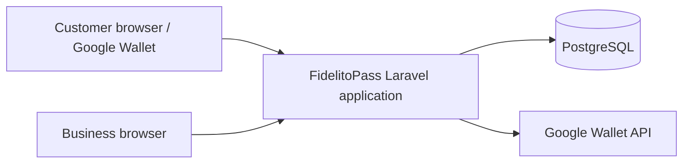
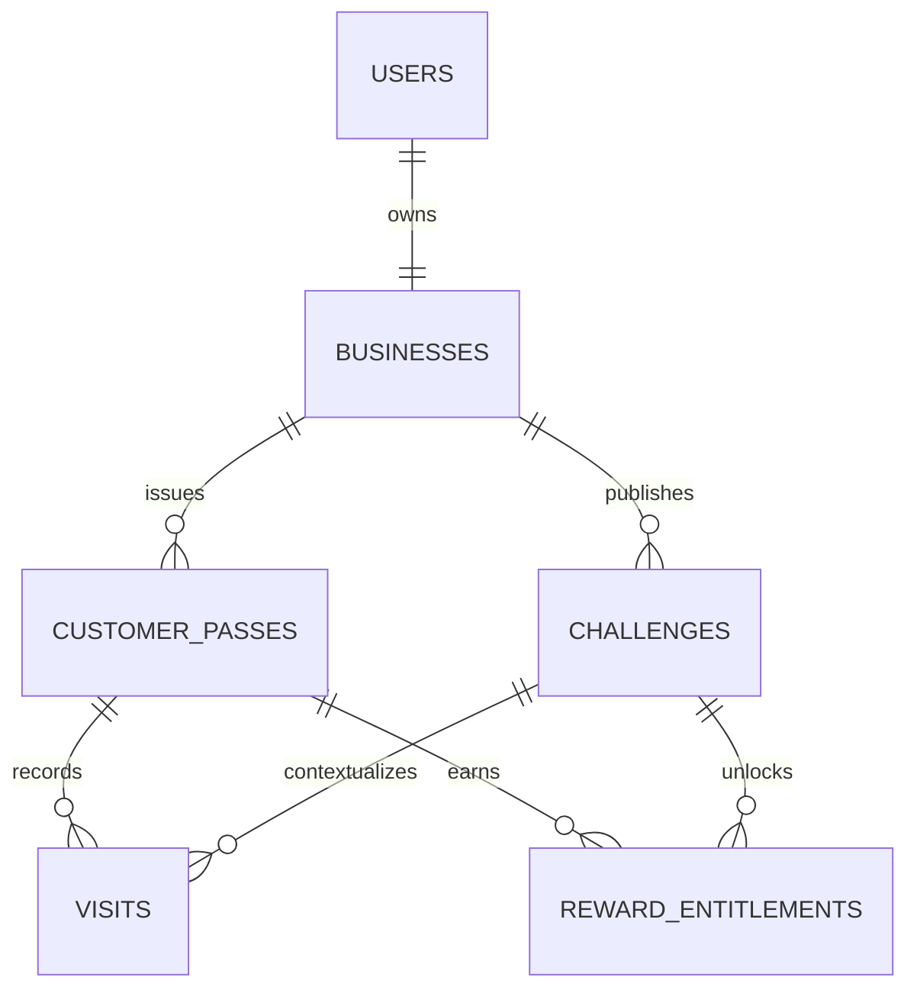

# FidelitoPass Architecture Overview

This document defines the MVP system boundaries and implementation shape.

## Architecture style

FidelitoPass is a conventional Laravel monolith backed by PostgreSQL.

Use Laravel conventions and Eloquent first. Add focused Actions for consequential business commands. Challenge progress uses one points-based rule, so no strategy hierarchy is required in MVP.

Do not introduce microservices, generic repositories, CQRS, event sourcing, or a generic rules engine in MVP.

## Technology baseline

| Concern | Technology |
|---|---|
| Runtime | PHP 8.4 |
| Framework | Laravel 13 |
| UI | Blade + Livewire 4 + Alpine.js |
| Components | Flux UI Free where suitable |
| Styling | Tailwind CSS 4 |
| Database | PostgreSQL 16 |
| Authentication | Laravel Starter Kit / Fortify foundation |
| Testing | Pest / PHPUnit + selected Playwright journeys |
| Development | Docker + Laravel Sail |
| Customer pass provider | Google Wallet |

## System context



FidelitoPass owns all business decisions. Google Wallet displays customer state and carries the validation token.

## Application responsibilities

| Responsibility | Owns |
|---|---|
| Public product | Landing page and Business join page. |
| Business account | Authentication and Business ownership. |
| Business profile | Name, branding, timezone, acquisition identity. |
| Challenge management | Draft configuration, publication, cancellation, schedule. |
| Challenge evaluation | Sum immutable points awarded by accepted Visits against one target. |
| Customer pass | Anonymous persistent Business/customer relationship. |
| Visit validation | Scanner/manual lookup, point award resolution, idempotency. |
| Reward | Unlock and one-time redemption. |
| Wallet integration | Business class/object mapping, issuance, synchronization, retry. |
| Logging | Request correlation and structured application/security events. |

## Domain model



A separate Redemption table is not required in MVP. Redemption finality is represented by `reward_entitlements.redeemed_at` and `redeemed_by_user_id`.

## Command boundaries

Use a focused Action when an operation owns a consequential transaction or external effect.

Expected Actions:

```text
PublishChallengeAction
CancelChallengeAction
IssueCustomerPassAction
ValidateVisitAction
RedeemRewardAction
```

Routine profile edits and ordinary reads remain conventional Eloquent/Livewire behaviour.

## Points and Challenge evaluation

MVP uses one Challenge rule:

```text
progress_points = sum(visits.points_awarded)
completed = progress_points >= challenge.target_points
```

At Visit validation time, FidelitoPass determines the point value that applies from the Business point configuration and Business-local time. The awarded value is stored on the Visit so later configuration changes do not rewrite history.

There is no Challenge strategy hierarchy, dynamic rule engine, condition tree, or expression language in MVP.

## Time model

### Storage

- Application timezone stays UTC.
- PostgreSQL session/default timezone stays UTC.
- Rule-relevant instants use `timestamptz`.
- Mutating operations set `visited_at`, `redeemed_at`, and related domain/audit-event timestamps from one post-lock PostgreSQL `clock_timestamp()` value named `operation_at`.
- Field `starts_at` is inclusive.
- Field `ends_at` is exclusive.

### Business calendar

The Business stores an IANA timezone such as `America/La_Paz`.

When a Challenge is published:

1. Copy the Business timezone to `challenge.timezone`.
2. Convert the local start date at `00:00` to `starts_at`.
3. Convert the local day after the selected end date at `00:00` to exclusive `ends_at`.

The snapshot prevents historical interpretation from changing if Business settings change later.

### Local-day calculations

Use PostgreSQL conversion when Business-local calendar meaning matters, including the optional special point rule:

```sql
(visited_at AT TIME ZONE challenge_timezone)::date
```

For read-only active/expired phase queries, use an explicitly current PostgreSQL wall-clock instant:

```sql
clock_timestamp()
```

For mutating decisions, acquire the relevant row locks first, capture `clock_timestamp()` exactly once as `operation_at`, and reuse it for every deadline check and Business-local calculation. Do not use transaction-start `CURRENT_TIMESTAMP` for lock-sensitive validity: a lock wait can make it stale.

## Visit validation transaction

`ValidateVisitAction` owns the complete authoritative operation.

Conceptual flow:

```text
begin transaction
  resolve authenticated Business
  lock relevant Customer pass and Challenge rows
  capture clock_timestamp() exactly once as operation_at
  validate pass belongs to Business
  check Challenge validity using operation_at
  resolve the point value using operation_at in the Challenge timezone
  enforce idempotency for the validation operation
  insert Visit with visited_at = operation_at and points_awarded
  sum awarded points for the active Challenge
  create Reward entitlement if target points are reached
commit
dispatch Wallet synchronization after commit
```

Locking the Customer pass serializes concurrent state changes for that pass. Legitimate repeat Visits on the same day are allowed; idempotency prevents technical retries from duplicating one validation operation.

## Redemption transaction

`RedeemRewardAction`:

```text
begin transaction
  resolve authenticated Business
  lock relevant entitlement and Challenge rows
  capture clock_timestamp() exactly once as operation_at
  validate Challenge active using operation_at
  validate not redeemed
  set redeemed_at = operation_at
  set redeemed_by_user_id
commit
dispatch Wallet synchronization after commit
```

## Google Wallet model

Use Google Wallet loyalty Class/Object semantics:

- One Business-level Loyalty Class for shared Business presentation where practical.
- One Loyalty Object per Customer pass.
- Progress/barcode/text modules mapped deterministically.
- The same Object is updated across Challenges.

The application does not use Wallet state as a source of truth.

## Background work

Wallet synchronization is the main asynchronous/retryable responsibility.

Use a Laravel job dispatched after commit when synchronization is not required to complete the counter interaction.

Jobs:

- Reload current authoritative state.
- Tolerate duplicate execution.
- Avoid changing domain eligibility.
- Log provider failures with request/domain correlation.
- Retry according to queue configuration.

## Public web surfaces

MVP surfaces:

```text
/
  Product landing

/join/{business}
  Business join / Add to Google Wallet

Authenticated Business
  Dashboard
  Challenge create/edit/preview
  Acquisition QR
  Validate visit
  Business settings
```

No customer profile portal is required.

## Deployment shape

The production unit is the Laravel web application plus PostgreSQL.

If Wallet synchronization uses queued jobs in production, the deployment also runs a queue worker using the same code/image.

TLS, secret injection, database hosting, backups, and process supervision belong to the deployment environment.

## Architectural constraints

- No customer account model.
- No generic loyalty rule engine.
- No second customer pass UI parallel to Google Wallet.
- No stored progress as the primary truth.
- No browser/app-server clock for domain validity.
- No duplicated local-date Visit column in MVP.
- No general audit table linked from every row.
- No analytics subsystem.
