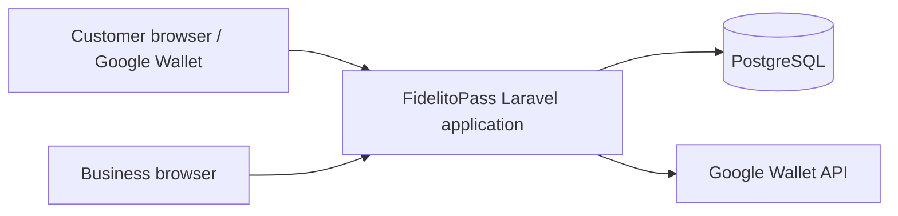
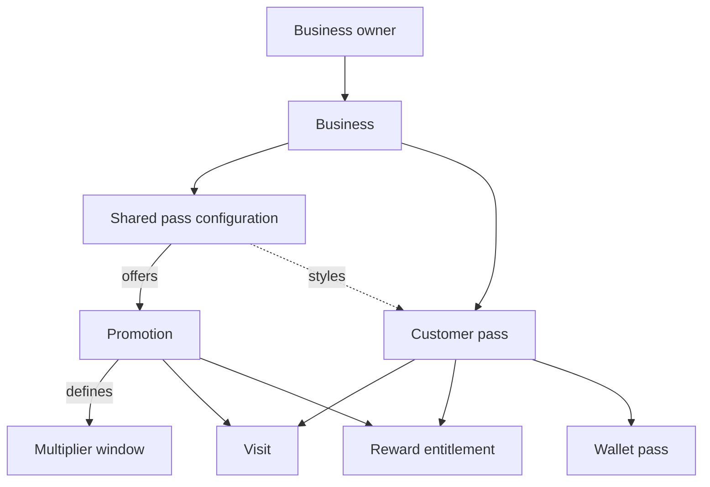

# FidelitoPass Architecture Overview

This document defines the MVP system boundaries and implementation shape.

## Architecture style

FidelitoPass is a conventional Laravel monolith backed by PostgreSQL.

Use Laravel conventions and Eloquent first. Add focused Actions for consequential business commands. Promotion progress
uses one points-based rule, so no strategy hierarchy is required in MVP.

Do not introduce microservices, generic repositories, CQRS, event sourcing, or a generic rules engine in MVP.

## Technology baseline

| Concern                | Technology                                    |
|------------------------|-----------------------------------------------|
| Runtime                | PHP 8.4                                       |
| Framework              | Laravel 13                                    |
| UI                     | Blade + Livewire 4 + Alpine.js                |
| Components             | Flux UI Free where suitable                   |
| Styling                | Tailwind CSS 4                                |
| Database               | PostgreSQL 16                                 |
| Authentication         | Laravel Starter Kit / Fortify foundation      |
| Testing                | Pest / PHPUnit + selected Playwright journeys |
| Development            | Docker + Laravel Sail                         |
| Customer pass provider | Google Wallet                                 |

## System context


```mermaid
flowchart LR
    C[Customer browser / Google Wallet] --> A[FidelitoPass Laravel application]
    B[Business browser] --> A
    A --> P[(PostgreSQL)]
    A --> G[Google Wallet API]
```

FidelitoPass owns all business decisions. Google Wallet displays customer state and carries the validation token.

## Application responsibilities

| Responsibility       | Owns                                                                                                                                    |
|----------------------|-----------------------------------------------------------------------------------------------------------------------------------------|
| Public product       | Landing page and Business join page.                                                                                                    |
| Business account     | Authentication and Business ownership.                                                                                                  |
| Business profile     | Name, branding, timezone, acquisition identity.                                                                                         |
| Promotion management | Editable drafts, atomic publication of a frozen configuration (including Reward and multiplier schedule), sequential scheduling, cancellation. |
| Promotion evaluation | Sum immutable points awarded by accepted Visits against one target.                                                                     |
| Customer pass        | Anonymous persistent Business/customer relationship.                                                                                    |
| Visit validation     | One scanner-first identification/confirmation/result dialog with visible manual fallback; point award resolution and idempotency.       |
| Reward               | Unlock and one-time redemption.                                                                                                         |
| Wallet integration   | Business class/object mapping, issuance, synchronization, retry.                                                                        |
| Logging              | Request correlation and structured application/security events.                                                                         |

## Domain model

This is a conceptual relationship map, not a table or foreign-key design. The Business controls shared pass configuration for appearance and the Promotion offering; each customer has a distinct persistent Customer pass represented by a Wallet pass. Promotions apply across customer passes and define their own multiplier windows. Whether shared configuration needs separate physical storage remains undecided.


```mermaid
flowchart TB
    U[Business owner] --> B[Business]
    B --> S[Shared pass configuration]
    S -->|offers| C[Promotion]
    B --> P[Customer pass]
    S -.->|styles| P
    C -->|defines| X[Multiplier window]
    P --> V[Visit]
    C --> V
    P --> E[Reward entitlement]
    C --> E
    P --> W[Wallet pass]
```

A separate Redemption table is not required in MVP. Redemption finality is represented by
`reward_entitlements.redeemed_at` and `redeemed_by_user_id`.

## Command boundaries

Use a focused Action when an operation owns a consequential transaction or external effect.

Expected Actions:

```text
PublishPromotionAction
CancelPromotionAction
IssueCustomerPassAction
ValidateVisitAction
RedeemRewardAction
```

Routine profile edits and ordinary reads remain conventional Eloquent/Livewire behaviour.

## Points and Promotion evaluation

MVP uses one Promotion rule:

```text
progress_points = sum(points_awarded for accepted Visits of this Promotion)
completed = progress_points >= promotion.target_points
```

Every regular Visit awards one point. A Promotion may own weekly recurring multiplier windows with x2, x3 or x5
multipliers: each local weekday has a whole-day rule or disjoint half-open timed windows, never both. Touching endpoints
are allowed; overnight windows must be split across weekdays. Exactly one rule applies at a time, never stacked; outside
the windows the value is x1. No Business-global or previous-Promotion schedule is inherited. At validation, derive the
local weekday and time from the post-lock operation instant and the active published Promotion's frozen timezone and
schedule. Store the awarded points on the Visit; later drafts, Business timezone changes and Promotions cannot rewrite
them.

There is no Promotion strategy hierarchy, dynamic rule engine, condition tree, or expression language in MVP.

## Time model

### Storage

- Application timezone stays UTC.
- PostgreSQL session/default timezone stays UTC.
- Rule-relevant instants use `timestamptz`.
- Mutating operations set `visited_at`, `redeemed_at`, and related domain/audit-event timestamps from one post-lock
  PostgreSQL `clock_timestamp()` value named `operation_at`.
- Field `starts_at` is inclusive.
- Field `ends_at` is exclusive.

### Business calendar

The Business stores an IANA timezone such as `America/La_Paz`.

Draft dates and preview display the current Business timezone, with no independent draft timezone selector. If the
Business timezone changes after draft review, require refreshed review and reconfirmation before publication; never
silently reinterpret the dates. When a Promotion is published:

1. Copy the confirmed Business timezone to the Promotion timezone snapshot.
2. Convert the local start date at `00:00` to `starts_at`.
3. Convert the local day after the selected end date at `00:00` to exclusive `ends_at`.
4. Freeze the entire published aggregate, including original local dates and UTC window, goal, Reward title and optional
   description, timezone and all multiplier windows (weekdays, times and values), even if scheduled.

Drafts remain editable. Cancellation is a separate transition; neither it nor later Business settings rewrite the
published snapshot.

### Local calendar and occupancy

Use PostgreSQL conversion when Business-local calendar meaning matters. For a Visit, derive the local weekday and time
from the single post-lock `operation_at` and the published Promotion timezone snapshot (not a stored local-date Visit
field):

```sql
operation_at
AT TIME ZONE promotion_timezone
```

Use that local weekday and time to select at most one frozen half-open multiplier window. Published Promotions occupy
`[starts_at, ends_at)`; cancellation truncates effective occupancy at `cancelled_at`, leaving an empty interval if
cancelled before start. Publication and cancellation serialize on the Business row lock and recompute occupancy after
locking. Reject intersecting effective intervals, allow touching endpoints, and keep at most one effectively active
Promotion. After intraday cancellation, a date-only replacement cannot start before the next Business-local midnight;
original publication instants remain unchanged.

For read-only scheduled/active/ended phase queries, use an explicitly current PostgreSQL wall-clock instant:

```sql
clock_timestamp
()
```

For mutating decisions, acquire the relevant row locks first, capture `clock_timestamp()` exactly once as
`operation_at`, and reuse it for every deadline check, occupancy decision, Business-local calculation and related
domain/audit timestamps. Do not use transaction-start `CURRENT_TIMESTAMP` for lock-sensitive validity: a lock wait can
make it stale.

## Visit validation transaction

`ValidateVisitAction` owns the complete authoritative operation.

Conceptual flow:

```text
begin transaction
  resolve authenticated Business
  lock relevant Customer pass and Promotion rows
  capture clock_timestamp() exactly once as operation_at
  validate pass belongs to Business
  check published Promotion is active and not cancelled using operation_at
  resolve one frozen Promotion-owned multiplier using operation_at in its timezone
  enforce idempotency for the validation operation
  insert Visit with visited_at = operation_at and points_awarded
  sum awarded points for the active Promotion
  create Reward entitlement if target points are reached
commit
dispatch Wallet synchronization after commit
```

The public acquisition QR identifies a join page, never a validation credential. The Wallet barcode contains a private
high-entropy validation token; a short Business-scoped manual code is a lookup fallback, not equivalent authority. Both
paths identify without mutation in the same scanner-first dialog; the authenticated owner explicitly confirms, then
server-side ownership and validity are rechecked in the transaction. Locking the Customer pass serializes concurrent
state changes for that pass. Legitimate repeat Visits on the same day are allowed; idempotency prevents technical
retries from duplicating one validation operation.

## Redemption transaction

`RedeemRewardAction`:

```text
begin transaction
  resolve authenticated Business
  lock relevant entitlement and Promotion rows
  capture clock_timestamp() exactly once as operation_at
  validate Promotion active and not cancelled using operation_at
  validate not redeemed
  set redeemed_at = operation_at
  set redeemed_by_user_id
commit
dispatch Wallet synchronization after commit
```

## Google Wallet model

Use Google Wallet loyalty Class/Object semantics:

- One Business-level Loyalty Class for shared Business presentation where practical.
- One Loyalty Object per Customer pass.
- Progress/barcode/text modules mapped deterministically.
- The same Object is updated across Promotions.

The application does not use Wallet state as a source of truth.

## Background work

Wallet synchronization is the main asynchronous/retryable responsibility.

Use a Laravel job dispatched after commit when synchronization is not required to complete the counter interaction.

Jobs:

- Reload current authoritative state.
- Tolerate duplicate execution.
- Avoid changing domain eligibility.
- Log provider failures with request/domain correlation.
- Retry according to queue configuration.

## Public web surfaces

MVP surfaces:

```text
/
  Product landing

/join/{business}
  Business join / Add to Google Wallet

Authenticated Business
  Dashboard
  Promotion draft/edit/preview/publish/cancel
  Acquisition QR
  Validate visit (one scanner/manual fallback dialog)
  Business settings
```

No customer profile portal is required.

## Deployment shape

The production unit is the Laravel web application plus PostgreSQL.

If Wallet synchronization uses queued jobs in production, the deployment also runs a queue worker using the same
code/image.

TLS, secret injection, database hosting, backups, and process supervision belong to the deployment environment.

## Architectural constraints

- No customer account model.
- No generic loyalty rule engine.
- No second customer pass UI parallel to Google Wallet.
- No stored progress as the primary truth.
- No browser/app-server clock for domain validity.
- No duplicated local-date Visit column in MVP.
- No general audit table linked from every row.
- No analytics subsystem.
