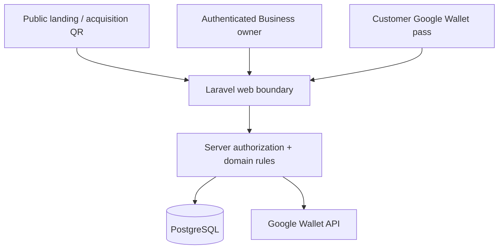

# FidelitoPass Security Architecture

This document defines the security controls required by the MVP.

The approach is intentionally small: security is designed into the domain boundaries and framework usage instead of being added as a separate subsystem.

## Security principles

- **Security by design:** authorization, credential separation, idempotency, and logging are part of the domain design.
- **Security by default:** a new Business/customer flow should be safe without optional configuration.
- **Least privilege:** each actor and credential receives only the authority it needs.
- **Server authority:** browser/Wallet input is untrusted until validated by Laravel and PostgreSQL.
- **Defense in depth:** authentication, authorization, validation, rate limiting, transaction integrity, and logging complement each other.
- **Fail safely:** provider or camera failure must not silently weaken validation rules.

## Trust boundaries



## Assets

Protect:

- Business owner account/session.
- Google Wallet issuer credentials/private key material.
- Customer validation tokens.
- Challenge configuration and Reward finality.
- Visit history.
- Reward entitlement state.
- Structured logs from secret leakage or forged context.

## Authentication

Business owners use Laravel's conventional authentication/session foundation.

Requirements:

- Password hashing remains framework-managed.
- Session cookies use secure production settings.
- CSRF protection stays enabled for state-changing browser requests.
- Login throttling remains enabled.
- Production debug output is disabled.

Do not introduce custom JWT authentication for the web application.

## Authorization

Authentication never implies ownership.

Every protected Business operation resolves the authenticated owner and verifies Business ownership server-side.

The server never trusts:

- Value `business_id` from a hidden form field.
- Value `customer_pass_id` supplied without Business scoping.
- Client-calculated Challenge progress.
- Client Reward state.

Use Laravel Policies or explicit authorization at the owning boundary.

## Credential classes

### Acquisition QR

Public.

Purpose:

- Identify a Business join page.
- Allow customers to start the Wallet flow.

It must never authorize a Visit or Redemption.

### Wallet validation token

Private high-entropy opaque token.

Purpose:

- Identify one Customer pass during scan validation.

Storage:

- Store only a hash/verifier when plaintext recovery is unnecessary.
- Never log the raw token.
- Do not expose it in shareable public URLs.

### Manual code

Short Business-scoped lookup identifier.

Purpose:

- Operational fallback when barcode scanning is unavailable.

It is **not** the sole authorization factor because:

- The Business owner must already be authenticated.
- Lookup is Business-scoped.
- Server authorization still applies.
- Repeated invalid attempts are throttled.

Use a sufficiently large short code space for the expected MVP scale and handle collisions at creation.

## Input validation

Treat all external input as untrusted.

- Use Laravel validation/Form Requests or Livewire validation.
- Prefer allowlists/enums/ranges over blacklist filtering.
- Validate Challenge target/Reward fields and the small point-earning configuration against explicit allowlists/ranges.
- Validate IANA timezone names against supported timezone identifiers.
- Validate public identifiers and manual codes by format before lookup.
- Use Eloquent/query-builder parameter binding; do not concatenate user input into raw SQL.

Client-side validation may improve UX but never replaces server validation.

## Visit and Reward finality

### Visit

`ValidateVisitAction`:

- Requires authenticated Business ownership.
- Locks the Customer pass.
- Uses database time.
- Enforces active Challenge.
- Resolves the point value that applies at the current Business-local time.
- Enforces idempotency so one technical validation operation creates at most one Visit.
- Allows legitimate repeat Visits when the Business intentionally validates a new customer visit.
- Creates at most one Reward entitlement.

### Reward

`RedeemRewardAction`:

- Requires authenticated Business ownership.
- Locks the entitlement.
- Checks Challenge validity using database time.
- Rejects already-redeemed state.
- Records one final `redeemed_at`.

Button disabling and browser state are UX only, not integrity controls.

## Rate limiting

Apply server-side rate/attempt limits to:

- Login.
- Manual-code lookup.
- Repeated invalid validation tokens.
- Reward redemption attempts.

Use Laravel RateLimiter/throttle capabilities before creating custom infrastructure.

Exact thresholds belong to configuration and can be tuned. The product requirement is that repeated invalid attempts become temporarily restricted and traceable.

## Secret management

Never commit:

- Application keys from production.
- Database passwords.
- Google Wallet private keys/service-account credentials.
- Signing material.

Use environment/deployment secret injection.

Example files contain placeholders only.

Production and development credentials must be separate.

## Security headers

Use a small baseline compatible with the application:

- Header `X-Content-Type-Options: nosniff`.
- Deny framing unless a documented feature requires it.
- Header `Referrer-Policy: strict-origin-when-cross-origin`.
- HSTS at the HTTPS production edge after TLS is correctly configured.

A strict CSP can be added only after it is tested against Livewire/Alpine/Vite requirements. Do not add an untested policy that breaks the application.

## Error handling

Customer/Business UI receives safe, actionable errors.

Do not expose:

- Stack traces.
- SQL.
- Filesystem paths.
- Provider credentials.
- Distinction that enables manual-code enumeration beyond what is operationally necessary.

Detailed exceptions remain in internal logs.

## Structured security logging

FidelitoPass uses application logs, not a general audit-table foreign key on every domain row.

Production log output is JSON so future log-management systems can ingest it without changing event semantics.

Every request receives a correlation identifier included in logs and returned in a response header where appropriate.

Recommended event context:

```text
event
request_id
actor_type
actor_id
business_id
challenge_id
customer_pass_id
outcome
reason
```

Include only fields that are relevant to the event.

Useful security/domain events include:

- Authentication throttled or anomalous failure.
- Invalid manual-code attempts above ordinary noise.
- Validation rejected for Business scope.
- Challenge cancellation.
- Reward redemption.
- Wallet synchronization failure.
- Unexpected authorization denial.

Never log:

- Passwords.
- Session cookies.
- CSRF tokens.
- Authorization headers.
- Raw Wallet validation tokens.
- Google private keys.
- Full provider payloads that contain credentials.

IP address and user agent may be included for security events when useful, but they are operational context, not customer identity.

## Dependencies and supply chain

Use the existing dependency lockfiles and automated dependency/security checks.

- Keep framework/dependencies supported and patched.
- Review high-severity dependency findings that affect reachable code.
- Keep secret scanning enabled in the delivery pipeline.
- Keep production dependencies smaller than development tooling where possible.

Do not add a new security platform only to satisfy a checklist.

## Security review triggers

Give additional review attention to changes affecting:

- Authentication or authorization.
- Wallet validation token generation/storage.
- Manual-code lookup.
- Visit idempotency/concurrency.
- Reward finality.
- Challenge time calculations.
- Outgoing Wallet credentials.
- Logging/sanitization.
