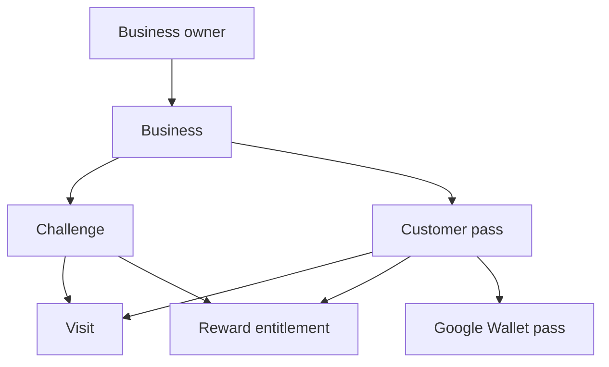
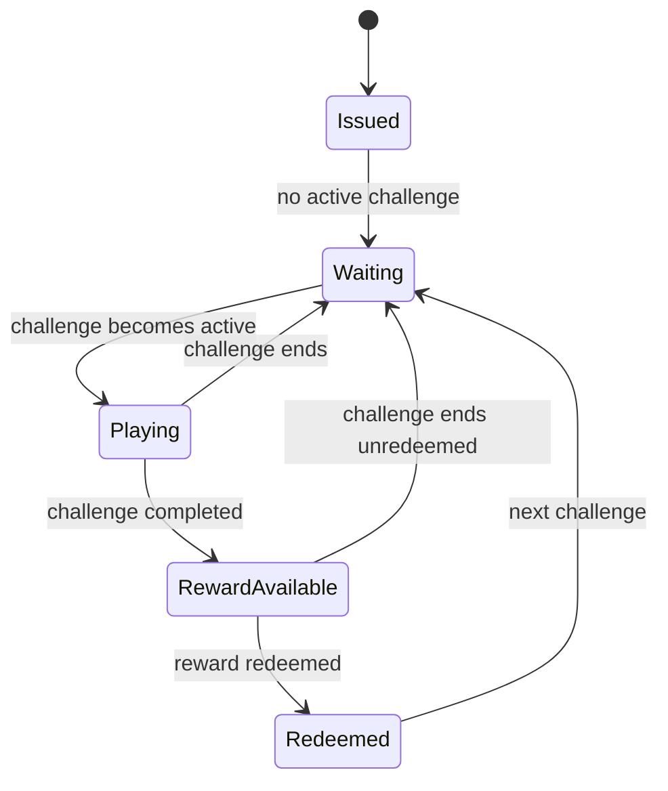

# FidelitoPass Conceptual Design

This document defines the product concept, actors, domain language, lifecycles, workflows, and invariants.

## Product concept

**FidelitoPass** is a wallet-native loyalty product for small local businesses.

A business publishes time-bound loyalty challenges. Customers join by scanning a permanent QR code at the business and save one persistent Google Wallet pass. The same pass remains linked to that business across future challenges.

Every accepted Visit is stored as an immutable timestamped fact with the points awarded at validation time. The active Challenge has one simple goal: reach a target number of points before it ends. When the customer reaches the target, one Reward becomes available and can be redeemed only while the Challenge is still valid.

The product deliberately avoids CRM, marketing automation, POS integration, and advanced analytics. Its differentiator is a simple recurring Challenge loop, immediate point feedback, time-limited Rewards, and one persistent Wallet pass that stays relevant over time.

## Product principles

1. One business can publish repeated loyalty challenges over time.
2. One customer keeps one Google Wallet pass per business.
3. The Wallet pass persists; challenge content changes inside the same pass.
4. A business has at most one active challenge at a time.
5. Every Challenge uses points as its only progress unit.
6. Visits are immutable facts and store the points awarded at validation time.
7. Legitimate repeat Visits on the same day may each award points.
8. Completing a Challenge unlocks one Reward entitlement.
9. The reward is redeemable only before the challenge window closes.
10. PostgreSQL is authoritative for all domain state.
11. Google Wallet is the customer-facing operational pass.
12. Customers do not create a FidelitoPass account in MVP.
13. Business-local calendar rules are evaluated from UTC instants using the challenge timezone.
14. Customer-facing challenge copy is generated by the platform, not authored as free-form rule text.

## Actors

| Actor | Responsibility | Access model |
|---|---|---|
| Business owner | Configure the business, create and publish challenges, validate visits, and redeem rewards. | Conventional authenticated account. |
| Customer | Save the business pass, return to the business, complete challenges, and claim rewards. | No FidelitoPass account. |
| Platform operator | Maintain service integrity and investigate operational or security incidents. | Administrative access outside normal business/customer flows. |

## Domain language

| Term | Meaning |
|---|---|
| Business | Local business operating one FidelitoPass loyalty experience. |
| Challenge | One global, time-bound loyalty campaign published by a business. |
| Customer pass | Persistent anonymous loyalty identity for one customer and one business. |
| Wallet pass | Google Wallet representation of the Customer pass. |
| Visit | One accepted physical-business visit for a Customer pass. |
| Challenge timezone | IANA timezone snapshot used to interpret calendar days for one published Challenge. |
| Points | The only customer-visible progress unit in MVP. Each accepted Visit stores the points awarded at that moment. |
| Point rule | Business configuration that defines the regular Visit value and one optional special weekday/time value. |
| Progress | Sum of points awarded by accepted Visits for the current Challenge. |
| Reward | Business-defined benefit attached to a Challenge. |
| Reward entitlement | One-time right created when a Customer pass completes a Challenge. |
| Acquisition QR | Permanent public QR used to join the Business and add its Wallet pass. |
| Validation token | High-entropy private value carried by the Wallet barcode. |
| Manual code | Short business-scoped lookup code shown with the pass as scanner fallback. |

## Core relationships



## Business lifecycle

MVP assumes one Business per authenticated owner.

The Business stores:

- Public identity and branding.
- One IANA timezone used as the default for new challenges.
- The permanent acquisition QR identity.

Changing the Business timezone affects only future Challenge publication. Each published Challenge stores its own timezone snapshot so historical behaviour never changes when Business settings change later.

## Challenge lifecycle

Stored status is intentionally small:

| Status | Meaning |
|---|---|
| `draft` | Editable and not visible to customers. |
| `published` | Scheduled, active, or ended according to its stored UTC window. |
| `cancelled` | Stopped explicitly by the Business. |

Operational phase is derived from database time:

| Phase | Rule |
|---|---|
| Scheduled | Published and an explicitly current PostgreSQL wall-clock instant is before `starts_at`. |
| Active | Published and `starts_at <=` that current PostgreSQL wall-clock instant `< ends_at`. |
| Ended | Published and that current PostgreSQL wall-clock instant is `>= ends_at`. |
| Cancelled | Stored status is `cancelled`. |

`ends_at` is exclusive. A challenge configured through the end of 31 October in the Business timezone stores an `ends_at` instant corresponding to local midnight at the start of 1 November.

Rules:

- Published challenge windows for one Business must not overlap.
- Target points, Reward semantics, timezone, and window are immutable once the Challenge is active.
- Visits are accepted only while the Challenge is active.
- Rewards cannot be unlocked or redeemed at or after `ends_at`.
- Cancellation stops new progress and redemption immediately.

## Customer pass lifecycle

One Customer pass persists across challenges.



The Customer pass is not recreated for each Challenge.

## Visit model

A Visit is an immutable historical fact.

Conceptually:

```text
customer_pass_id
challenge_id
points_awarded
visited_at
validated_by_user_id
idempotency_key
```

`visited_at` is a PostgreSQL `timestamptz` set from the mutating operation's one post-lock database-derived instant. FidelitoPass does not persist a duplicated local-date Visit column in MVP.

The Business-local date is derived when required:

```sql
(visited_at AT TIME ZONE challenge_timezone)::date
```

MVP rules:

- A Visit is created only after the authenticated Business confirms validation.
- After acquiring relevant row locks, a mutating transaction captures PostgreSQL `clock_timestamp()` exactly once as `operation_at` and reuses it for validity checks, Business-local point-rule evaluation, `visited_at`, and related audit/event timestamps.
- Legitimate repeat Visits on the same Business-local day may each be accepted.
- Technical retries of the same validation operation return the prior accepted result through idempotency.
- Visits remain stored after Challenge completion, expiration, cancellation, or redemption.
- Changes to point configuration never rewrite historical `points_awarded` values.

## Challenge model

A Challenge contains:

```text
target_points
reward_title
reward_description
timezone
starts_at
ends_at
status
```

Every Challenge uses the same rule:

> Reach the configured target points before the Challenge ends.

The Business point configuration determines how many points a Visit is worth at validation time. MVP supports a regular Visit value and at most one optional special rule for one weekday, either for the full day or one time range.

The platform owns generated Challenge description, progress copy, Reward states, and Wallet mapping. The Business does not write expressions, conditions, or formulas.

## Reward semantics

MVP has one Reward per Challenge.

- Challenge completion creates at most one Reward entitlement per Customer pass.
- The entitlement becomes available immediately.
- The Challenge `ends_at` is also the final redemption deadline.
- Redemption is final and can occur once.
- Unredeemed entitlements become unusable when the Challenge ends.
- Redemption does not delete Visits.
- The entitlement itself stores only the facts required for unlock and redemption; expiry is derived from the Challenge.

## Main workflows

### Create and publish a challenge

1. The Business owner signs in.
2. The owner defines the Challenge start date, end date, target points, and one Reward.
3. The owner can review the current point-earning configuration that will apply to future Visits.
4. FidelitoPass shows a deterministic Wallet preview.
5. The Challenge is saved as draft.
6. On publication, FidelitoPass snapshots the Business timezone and resolves the local dates to UTC `starts_at` and exclusive `ends_at`.
7. Publication fails if its window overlaps another published Challenge.

### Join the Business

1. The customer scans the permanent acquisition QR.
2. A lightweight Business join page explains the current Challenge or waiting state.
3. The customer selects **Add to Google Wallet**.
4. FidelitoPass creates an anonymous Customer pass.
5. Google Wallet receives the Business pass.
6. No customer registration is required.

### Validate a visit

1. The customer opens the Wallet pass.
2. The Business opens **Validate visit**.
3. The scanner is shown first.
4. The manual-code input is always immediately below the scanner.
5. FidelitoPass identifies the Customer pass.
6. The Business confirms **Register visit**.
7. Inside one transaction, FidelitoPass acquires the relevant Customer pass and Challenge locks, then captures PostgreSQL `clock_timestamp()` exactly once as `operation_at`; it reuses that instant to check validity, resolve the Business-local point value, and create the Visit with `visited_at` and `points_awarded`.
8. FidelitoPass sums awarded points for the active Challenge and derives the new progress.
9. FidelitoPass creates the Reward entitlement if the target points have been reached.
10. Wallet synchronization is requested after local state commits.

### Redeem a reward

1. The customer presents the same Wallet pass.
2. The Business scans it or enters the manual code.
3. FidelitoPass detects the available Reward entitlement.
4. The primary action becomes **Redeem reward**.
5. The Business confirms.
6. After acquiring the relevant entitlement and Challenge locks, FidelitoPass captures PostgreSQL `clock_timestamp()` exactly once as `operation_at`, uses it for the redemption deadline check, and records it as the final redemption timestamp with the operator.
7. Wallet is synchronized after commit.

### Finish a challenge

When the Challenge reaches `ends_at`:

- No new Visits are accepted for that Challenge.
- No new entitlements are created.
- Unredeemed entitlements become unusable.
- Redemption is disabled.
- Customer passes stay installed.
- Wallet shows a deterministic waiting state until a future Challenge becomes relevant.

## Invariants

- Every Business has exactly one owner in MVP.
- Every published Challenge has one immutable timezone snapshot.
- Challenge windows are stored as UTC instants and use an exclusive end.
- A Business has at most one Active Challenge at any instant.
- A Customer pass belongs to one Business.
- A Visit belongs to one Customer pass and one Challenge from the same Business.
- Field `visited_at` comes from the mutation's single post-lock PostgreSQL `clock_timestamp()` value, not the browser or application host clock.
- Lock-sensitive mutations reuse one `operation_at` for deadline checks, Business-local rule evaluation, domain timestamps, and related audit/event timestamps; read-only phase queries use an explicitly current PostgreSQL wall-clock instant.
- Legitimate repeat Visits on the same Business-local day may each be accepted and award points.
- Public acquisition identifiers never authorize Visit or Reward operations.
- The Wallet validation token and manual lookup code have different authority.
- Challenge progress is the sum of immutable `points_awarded` values from accepted Visits for that Challenge.
- One Customer pass can receive at most one Reward entitlement per Challenge.
- One Reward entitlement can be redeemed at most once.
- Wallet synchronization failure never rewrites committed domain facts.
