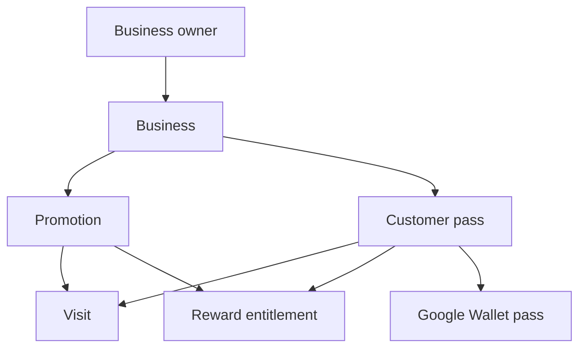
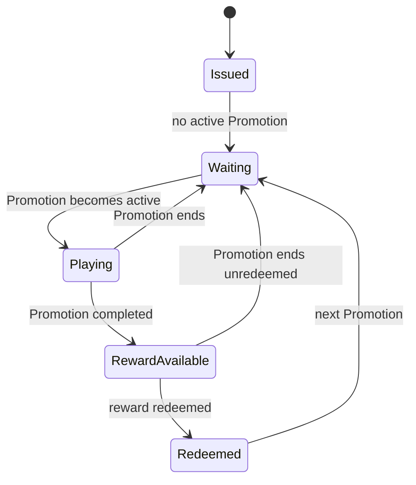

# FidelitoPass Conceptual Design

This document defines the product concept, actors, domain language, lifecycles, workflows, and invariants.

## Product concept

**FidelitoPass** is a wallet-native loyalty product for small local businesses.

A business publishes time-bound loyalty Promotions (**Promociones** in the interface). Customers join by scanning a permanent acquisition QR at the business and save one persistent Google Wallet pass. The same pass remains linked to that business across future Promotions.

Every accepted Visit is stored as an immutable timestamped fact with the points awarded at validation time. The active Promotion has one simple goal: reach a target number of points before it ends. When the customer reaches the target, one Reward becomes available and can be redeemed only while the Promotion is still valid.

The product deliberately avoids customer accounts, CRM, marketing automation, POS integration, payments, multiple branches or staff roles, simultaneous active Promotions, multiple or inventory-limited Rewards, generic progress mechanics, Apple Wallet, native apps, and advanced analytics. Its differentiator is a simple recurring Promotion loop, immediate point feedback, time-limited Rewards, and one persistent Wallet pass that stays relevant over time.

## Product principles

1. One business can publish repeated loyalty Promotions over time.
2. One customer keeps one Google Wallet pass per business.
3. The Wallet pass persists; Promotion content changes inside the same pass.
4. A business has at most one active Promotion at a time.
5. Every Promotion uses points as its only progress unit.
6. Visits are immutable facts and store the points awarded at validation time.
7. Legitimate repeat Visits on the same day may each award points.
8. Completing a Promotion unlocks one Reward entitlement.
9. The reward is redeemable only before the Promotion window closes.
10. PostgreSQL is authoritative for all domain state.
11. Google Wallet is the customer-facing operational pass.
12. Customers do not create a FidelitoPass account in MVP.
13. Business-local calendar rules are evaluated from UTC instants using the Promotion timezone.
14. Customer-facing Promotion copy is generated by the platform, not authored as free-form rule text.

## Actors

| Actor | Responsibility | Access model |
|---|---|---|
| Business owner | Configure the business, create and publish Promotions, validate visits, and redeem rewards. | Conventional authenticated account. |
| Customer | Save the business pass, return to the business, complete Promotions, and claim rewards. | No FidelitoPass account. |
| Platform operator | Maintain service integrity and investigate operational or security incidents. | Administrative access outside normal business/customer flows. |

## Domain language

| Term | Meaning |
|---|---|
| Business | Local business operating one FidelitoPass loyalty experience. |
| Promotion | A time-bound instance of the single points-based loyalty mechanic, published by a Business. |
| Customer pass | Persistent anonymous loyalty identity for one customer and one business. |
| Wallet pass | Google Wallet representation of the Customer pass. |
| Visit | One accepted physical-business visit for a Customer pass. |
| Promotion timezone | IANA timezone snapshot used to interpret calendar days for one published Promotion. |
| Points | The only customer-visible progress unit in MVP. Each accepted Visit stores the points awarded at that moment. A Promotion can offer **Puntos extra**: x2, x3 or x5 instead of the regular one point on configured local days and times. |
| Progress | Sum of points awarded by accepted Visits for the current Promotion. |
| Reward | Business-defined benefit attached to a Promotion. |
| Reward entitlement | One-time right created when a Customer pass completes a Promotion. |
| Acquisition QR | Permanent public QR used to join the Business and add its Wallet pass. |
| Validation token | High-entropy private value carried by the Wallet barcode. |
| Manual code | Short business-scoped lookup code shown with the pass as scanner fallback. |

## Core relationships

```mermaid
flowchart TB
    U[Business owner] --> B[Business]
    B --> C[Promotion]
    B --> P[Customer pass]
    P --> V[Visit]
    C --> V
    C --> E[Reward entitlement]
    P --> E
    P --> W[Google Wallet pass]
```

## Business lifecycle

MVP assumes one Business per authenticated owner.

The Business stores:

- Public identity and branding.
- One validated, visible IANA timezone used as the default for new Promotions.
- The permanent acquisition QR identity.

Registration saves the Business name and its visible, validated IANA timezone atomically with the owner. Summary is the ordinary authenticated application home, not a required first stop after sign-in; its Pase setup action opens the same Pase route as navigation, not a separate wizard. The acquisition QR remains public and permanent, never a validation credential.

Changing the Business timezone affects only future Promotion publication. Drafts display the current Business timezone; if it changes after the owner reviewed a draft, publication asks the owner to reconfirm before freezing the new timezone. Each published Promotion stores its own timezone snapshot so historical behaviour never changes when Business settings change later.

## Promotion lifecycle

Stored status is intentionally small:

| Status | Meaning |
|---|---|
| Draft | Editable and not visible to customers. |
| Published | Scheduled, active, or ended according to its stored UTC window; its complete configuration is immutable. |
| Cancelled | Stopped explicitly by the Business. |

Operational phase is derived from database time:

| Phase | Rule |
|---|---|
| Scheduled | Published and the explicitly current PostgreSQL wall-clock instant is before its start. |
| Active | Published and the current PostgreSQL instant is at or after its start but before its exclusive end. |
| Ended | Published and that instant is at or after its end. |
| Cancelled | Its stored status is Cancelled. |

The end is exclusive. A Promotion configured through 31 October in the Business timezone ends at the UTC instant corresponding to local midnight at the start of 1 November.

Rules:

- A Business may retain multiple drafts and sequential future scheduled Promotions; at most one Promotion is effectively Active at an instant.
- Published effective windows for one Business must not overlap; touching endpoints are allowed. Cancellation releases only remaining occupancy, empty if cancelled before start, without changing the original UTC window or historical record.
- The entire draft, including its Reward and Puntos extra, remains editable. Draft save and publication are atomic; publication freezes the full configuration: goal, Reward title and optional description, dates, timezone and weekly days, times and multipliers, even when scheduled. Cancellation is a separate lifecycle transition, not an edit or deletion.
- Visits are accepted only while the Promotion is active.
- Rewards cannot be unlocked or redeemed at or after the exclusive end.
- Scheduled or active cancellation records its instant at the single post-lock PostgreSQL operation instant and stops effective progress/redemption immediately. Publication and cancellation serialize for the Business and recompute occupancy after locking. A date-only replacement after intraday cancellation starts no earlier than the next Business-local midnight.

## Customer pass lifecycle

One Customer pass persists across Promotions.

```mermaid
stateDiagram-v2
    [*] --> Issued
    Issued --> Waiting: no active Promotion
    Waiting --> Playing: Promotion becomes active
    Playing --> RewardAvailable: Promotion completed
    RewardAvailable --> Redeemed: reward redeemed
    Playing --> Waiting: Promotion ends
    RewardAvailable --> Waiting: Promotion ends unredeemed
    Redeemed --> Waiting: next Promotion
```

The Customer pass is not recreated for each Promotion.

## Visit model

A Visit is an immutable historical fact.

Each Visit ties one Customer pass to one Promotion, records the points awarded and validation instant, identifies the validating owner, and carries an operation identity for safe retries.

The Visit instant comes from the mutating operation's one post-lock PostgreSQL-derived instant, not a browser clock. No duplicated local Visit date is stored in MVP: derive the Business-local date from that instant in the published Promotion timezone when needed.

MVP rules:

- A Visit is created only after the authenticated Business confirms validation.
- After acquiring relevant row locks, a mutating transaction captures one post-lock PostgreSQL operation instant and reuses it for validity checks, Business-local Puntos extra evaluation, the Visit instant, and related audit/event timestamps.
- Legitimate repeat Visits on the same Business-local day may each be accepted.
- Technical retries of the same validation operation return the prior accepted result through idempotency.
- Visits remain stored after Promotion completion, expiration, cancellation, or redemption.
- Draft changes and later Promotions never rewrite historical points awarded; published configurations cannot be edited.

## Promotion model

A Promotion defines the goal in points, Reward title and optional description, Business-local start and end dates, timezone, lifecycle status, and optional **Puntos extra**.

Every Promotion uses the same rule:

> Reach the configured target points before the Promotion ends.

Every accepted regular Visit awards one point. Each Promotion may offer weekly recurring x2, x3 or x5 on local weekdays, either for a whole day or in several disjoint half-open timed windows on that day, never both. Touching endpoints are allowed; split overnight intervals across days. Windows never stack, and outside them the Visit awards one point. New Promotions inherit no previous or Business-global Puntos extra configuration. Future Visits use the active published Promotion's frozen timezone and schedule; past awarded points remain immutable.

The platform owns generated Promotion description, progress copy, Reward states, and Wallet mapping. The Business does not write expressions, conditions, or formulas.

## Reward semantics

MVP has one Reward per Promotion.

- Promotion completion creates at most one Reward entitlement per Customer pass.
- The entitlement becomes available immediately.
- The Promotion's exclusive end is also the final redemption deadline.
- Redemption is final and can occur once.
- Unredeemed entitlements become unusable when the Promotion ends.
- Redemption does not delete Visits.
- The entitlement itself stores only the facts required for unlock and redemption; expiry is derived from the Promotion.

## Main workflows

### Create and publish a Promotion

1. The Business owner navigates to Pase after authentication, either through normal navigation or Summary's setup action; both use the same Pase route.
2. The owner defines Promotion dates, target points, one Reward with optional description, and optional **Puntos extra** days, times and multipliers.
3. The owner reviews this Promotion's configuration in the current Business timezone; a timezone change since review requires reconfirmation before publication.
4. FidelitoPass shows a deterministic Wallet preview.
5. The entire configuration is saved atomically as an editable draft, or published atomically.
6. On publication, FidelitoPass snapshots the confirmed Business timezone and converts local calendar dates to UTC instants with an exclusive end, freezing the full configuration even for scheduled Promotions.
7. Under the Business lock, publication captures one post-lock PostgreSQL instant and rejects overlap with effective published occupancy; touching endpoints are allowed. Cancellation takes the same lock and releases remaining future occupancy without mutating original publication terms.

### Join the Business

1. The customer scans the permanent acquisition QR.
2. A lightweight Business join page explains the current Promotion or waiting state.
3. The customer selects **Add to Google Wallet**.
4. FidelitoPass creates an anonymous Customer pass.
5. Google Wallet receives the Business pass.
6. No customer registration is required.

### Validate a visit

1. The customer opens the Wallet pass.
2. The Business opens **Validate visit**.
3. One scan dialog shows the scanner first, with visible manual-code fallback immediately below it.
4. A scan or manually entered code identifies the Customer pass without treating the acquisition QR as authorization.
5. FidelitoPass identifies the Customer pass.
6. The Business explicitly confirms **Register visit**; a retry of that operation cannot record a second Visit.
7. Inside one transaction, FidelitoPass acquires the relevant Customer pass and Promotion locks, then captures one post-lock PostgreSQL operation instant; it reuses that instant to check validity, resolve the Business-local point value, and record the Visit instant and awarded points.
8. FidelitoPass sums awarded points for the active Promotion and derives the new progress.
9. FidelitoPass creates the Reward entitlement if the target points have been reached.
10. Wallet synchronization is requested after local state commits.

### Redeem a reward

1. The customer presents the same Wallet pass.
2. The Business uses the same scan dialog or its visible manual-code fallback.
3. FidelitoPass detects the available Reward entitlement.
4. The primary action becomes **Redeem reward**.
5. The Business confirms.
6. After acquiring the relevant entitlement and Promotion locks, FidelitoPass captures one post-lock PostgreSQL operation instant, uses it for the redemption deadline check, and records it as the final redemption timestamp with the operator.
7. Wallet is synchronized after commit.

### Finish a Promotion

When the Promotion reaches its exclusive end:

- No new Visits are accepted for that Promotion.
- No new entitlements are created.
- Unredeemed entitlements become unusable.
- Redemption is disabled.
- Customer passes stay installed.
- Wallet shows a deterministic waiting state until a future Promotion becomes relevant.

## Invariants

- Every Business has exactly one owner in MVP.
- Every published Promotion freezes its goal, Reward title and optional description, dates, timezone and Puntos extra schedule; cancellation preserves that snapshot.
- Promotion windows are stored as UTC instants and use an exclusive end.
- A Business may retain multiple drafts and future scheduled Promotions but has at most one effectively Active Promotion at any instant; published occupied windows never overlap.
- A Customer pass belongs to one Business.
- A Visit belongs to one Customer pass and one Promotion from the same Business.
- The Visit instant comes from the mutation's single post-lock PostgreSQL instant, not the browser or application host clock.
- Lock-sensitive mutations reuse one operation instant for deadline checks, Business-local Puntos extra evaluation, domain timestamps and related audit events; read-only phase queries use an explicitly current PostgreSQL wall-clock instant.
- Legitimate repeat Visits on the same Business-local day may each be accepted and award points.
- Public acquisition identifiers never authorize Visit or Reward operations.
- The Wallet validation token and manual lookup code have different authority.
- Promotion progress is the sum of immutable awarded points from accepted Visits for that Promotion.
- One Customer pass can receive at most one Reward entitlement per Promotion.
- One Reward entitlement can be redeemed at most once.
- Wallet synchronization failure never rewrites committed domain facts.
